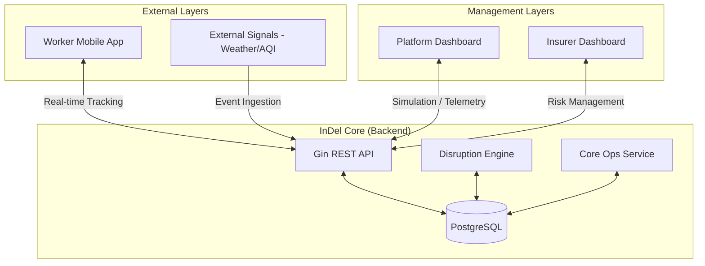
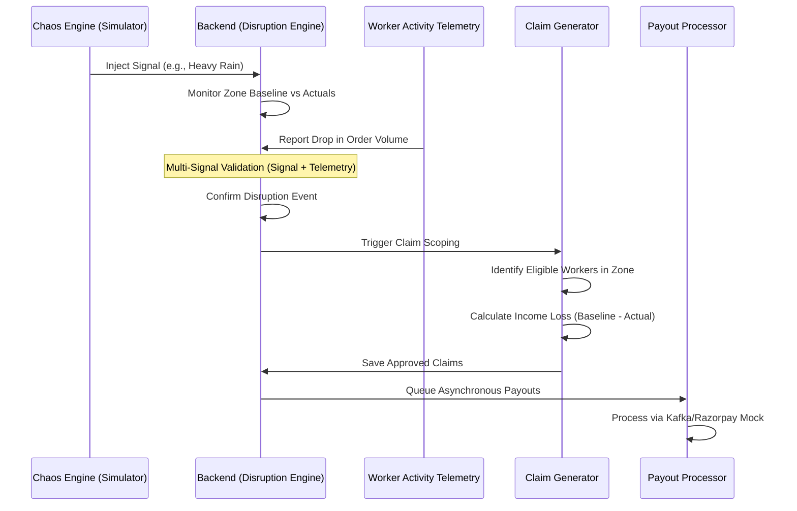

# InDel — Implementation Phase 2

This document provides a technical and execution-focused overview of the InDel platform as implemented in Phase 2.

## Functional Architecture

InDel is an event-driven parametric insurance ecosystem designed to protect gig-worker income from regional disruptions. The architecture is composed of a high-performance Go backend, dual enterprise React dashboards, and a native mobile application.

### System Components

The following diagram illustrates the high-level relationship between the platform's core components:

###  Economic Impact Lifecycle

This sequence diagram traces the flow from a triggered disruption to an automated payout:

---

## Repository Structure

The repository is organized into distinct modules for backend logic, dashboard management, and mobile operations.

###  Repository Root
- `backend/`: Core Go API and business logic.
- `insurer-dashboard/`: React application for insurance providers.
- `platform-dashboard/`: React application for platform operators and simulator control.
- `worker-app/`: Native Kotlin implementation for worker-side tracking and notifications.
- `migrations/`: SQL schema definitions and baseline data seeds.
- `ml/`: Model training scripts and synthetic data generators.
- `PHASE_2.md`: This implementation-focused documentation.
- `README.md`: High-level project vision and theoretical background.

###  Backend Deep Dive (`/backend`)
- `cmd/api/`: Entry point for the Gin server.
- `internal/handlers/`: Domain-specific API endpoint logic.
    - `platform/`: Zone monitoring and Chaos Engine endpoints.
    - `insurer/`: Policy and risk analytics endpoints.
    - `worker/`: Identity and notification endpoints.
    - `demo/`: Specialized simulation and seeding handlers.
- `internal/services/`: The "Engine" layer containing core business logic.
    - `disruption_engine.go`: Logic for real-time baseline calculation and disruption confirmation.
    - `core_ops_service.go`: Batch processing for claim generation, eligibility checks, and payouts.
    - `premium_pricing.go`: Dynamic risk-based pricing logic.
- `internal/models/`: GORM-based entity definitions (Users, Zones, Policies, Claims).
- `internal/router/`: Centralized Gin route definitions.

###  Dashboard Deep Dive (`/platform-dashboard` & `/insurer-dashboard`)
- `src/api/`: Axios-based clients for backend communication.
- `src/components/`: Reusable UI components.
    - `layout/`: Shared Sidebar and Navbar with theme management.
    - `ui/`: Atomic components like panels, badges, and metrics.
- `src/pages/`: Feature-specific views.
    - `Overview.tsx`: Holistic system health telemetry.
    - `Disruptions.tsx`: The "Chaos Engine" simulation interface.
    - `Workers.tsx`: Native-style searchable node directory.
- `src/context/`: React Context for Theme (Light/Dark) and Global State.

---

##  Core Functional Components

### 1. Disruption Engine (The Brain)
The engine maintains a sliding 10-minute window of regional order volume. It calculates a **Dynamic Baseline** for each zone. A disruption is confirmed only through **Multi-Signal Validation**:
- **Environmental**: External signal (Weather, AQI, Curfew).
- **Economic**: Internal telemetry showing a >30% drop in order volume relative to the baseline.

### 2. Core Ops Service (The Scale)
This service handles high-volume batch operations. When a disruption is confirmed, it:
1. Scans the database for all workers with **Active Policies** in the affected zone.
2. Identifies workers who were **Logged In** during the disruption.
3. Computes **Income Loss** using the worker's historical 4-week average vs. actual earnings.
4. Generates a **Claim Record** with an automated fraud verdict based on the signal strength.

### 3. Chaos Engine (The Simulator)
Integrated directly into the Platform Dashboard, the Chaos Engine provides a practical way to test the entire parametric pipeline. It allows for:
- **Demand Collapse**: Artificially resetting the baseline to simulate a massive order drop.
- **Signal Injection**: Sending real-time weather or local restriction events to the backend.

---
Platform Dashboard

Insurer Dashboard

Mobile App

---
## Technical Specifications

- **Backend**: Go (Gin), PostgreSQL (GORM), JWT.
- **Frontend**: React 18 (Vite), Tailwind CSS, Lucide Icons.
- **Theme**: Enterprise High-Precision (Slate/Orange).
- **Communication**: 2-second polling interval for real-time telemetry updates.

> [!NOTE]
> All automated systems are idempotent, ensuring that mass disruption events do not cause duplicate claim generation or payout errors.
