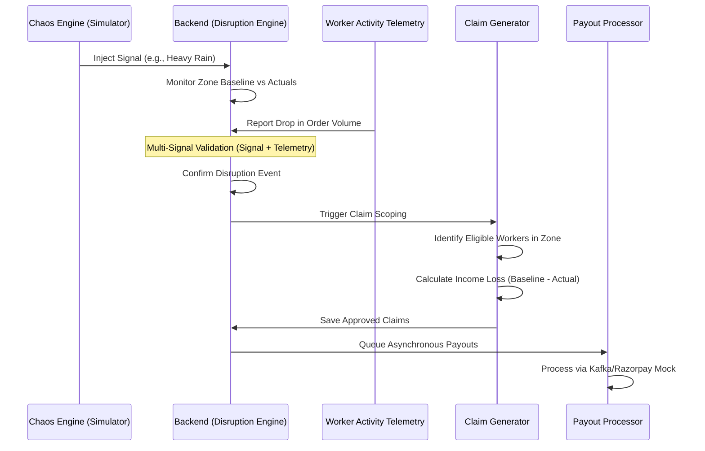

# InDel — Insure, Deliver

> **When the rain falls, the orders stop. Workers lose income. Nothing protects them.**
> InDel changes that — parametric income insurance, automated end-to-end, built for India's gig economy.

**Team:** ImaginAI · **Hackathon:** Guidewire DEVTrails 2026 · **Persona:** E-commerce · **Phase:** 2 — Automation & Protection

> [!NOTE]
> For instructions on running the project locally, refer to [SETUP.md](./SETUP.md).

---

## Contents

- [The Problem](#the-problem)
- [What InDel Does](#what-indel-does)
- [Demo Video](#demo-video)
- [System Architecture](#system-architecture)
- [Economic Impact Lifecycle](#economic-impact-lifecycle)
- [Registration & Policy Management](#registration--policy-management)
- [Dynamic Premium Calculation](#dynamic-premium-calculation)
- [Automated Disruption Triggers](#automated-disruption-triggers)
- [Zero-Touch Claim Process](#zero-touch-claim-process)
- [Infrastructure — Kafka, Zookeeper & Docker](#infrastructure--kafka-zookeeper--docker)
- [Claims Management](#claims-management)
- [Platform Architecture](#platform-architecture)
- [Dashboards](#dashboards)
- [ML Model Summary](#ml-model-summary)
- [Illustrative Unit Economics](#illustrative-unit-economics)
- [Tech Stack](#tech-stack)
- [Team ImaginAI](#team-imaginai)

---

## The Problem

India has **15+ million gig delivery workers**. Their income is entirely contingent on completing orders. When a flood hits, when AQI crosses hazardous, when a curfew drops — deliveries stop. Income collapses. There is no fallback.

Workers lose **20–30% of monthly income** during disruption events. Not a single insurance product on the market covers this.

Traditional insurance covers accidents and vehicles. Existing parametric attempts need delivery platforms to share worker data — and those platforms have no incentive to. The result: unverifiable claims, rampant fraud, no product that works.

**InDel doesn't ask for that data. It owns it.**

---

## What InDel Does

InDel is a **B2B parametric income insurance platform** — built for insurance providers who want to reach an underserved, high-volume worker segment without building the data infrastructure themselves.

The key insight: stop depending on third-party platform data. Instead, operate the delivery layer directly. InDel integrates with e-commerce and logistics platforms as a white-label delivery management system. Workers receive assignments, complete deliveries, and earn — all through InDel. The insurance engine runs on that same first-party data.

```
❌ Old way:
Insurer → requests data from Swiggy/Zomato → access denied → weak verification → fraud

✅ InDel way:
Insurer deploys InDel → InDel integrates via API → delivery + insurance share one data layer
→ first-party verification → accurate payouts → zero manual claims
```

The insurer gets a ready-to-deploy infrastructure. The worker gets protection that runs silently in the background. **They never file a claim. It just arrives.**

---

## 🎥 Demo Video

[](https://www.youtube.com/watch?v=R1_1X-f7-MM)

---

## System Architecture


---

## Economic Impact Lifecycle

Every disruption follows the same automated path — signal in, payout out, no human in the loop.



---

## Registration & Policy Management

Workers register once. Coverage runs forever in the background.

Onboarding captures name, home zone, preferred hours, vehicle type (EV or ICE — this affects pricing), UPI/bank details for payouts, and device ID for identity linking. Income protection is **opt-in**, surfaced as a clear separate choice — never buried in terms.

Once enrolled, coverage is automatic. No renewals, no forms, no calls. The policy lifecycle is equally hands-off:

| State | What triggers it |
|---|---|
| **Active** | Premium paid, coverage running |
| **Paused** | 1 missed weekly payment |
| **Suspended** | 2+ consecutive missed weeks |
| **Rewarded** | Consistent payments, no claims → reduced premium or extended ceiling |

Cold-start workers (under 20 verified deliveries) use zone-average baselines for income calculation. Any claim filed within the first 7 days of enrollment is automatically held for manual review — preventing opportunistic sign-ups timed around known disruption events.

---

## Dynamic Premium Calculation

No flat rates. No city-wide averages. Every worker gets a premium calculated from their specific zone, their own earnings history, and live environmental signals.

### Step 1 — The Risk Score

$$R = (V_o \times 0.24) + (V_e \times 0.22) + (D_r \times 0.20) + (S_{weather} \times 0.34)$$

| Variable | What it measures | Weight |
|---|---|---|
| $V_o$ | Order Volatility — how erratic demand is in this zone | 24% |
| $V_e$ | Earnings Volatility — how stable this worker's income is | 22% |
| $D_r$ | Disruption Rate — how often this zone has triggered events historically | 20% |
| $S_{weather}$ | Aggregated Weather Signal — live rain, AQI, temperature score | **34%** |

Weather carries the highest weight because it is the strongest and most consistent predictor of delivery income loss across Indian urban zones. A worker in waterlogging-prone Tambaram during monsoon season is a fundamentally different risk than the same worker profile in Bengaluru in February.

### Step 2 — The Premium

$$P = (E_{avg} \times 0.0375) \times (0.72 + R) \times VF$$

- **$E_{avg}$** — worker's average daily earnings over the past 4 weeks, from InDel's own records
- **$R$** — the risk score above, recalculated monthly (continuous in production)
- **$VF$** — Vehicle Factor between 1.04–1.08: EVs are rewarded with a lower multiplier to incentivise sustainable delivery

A worker earning ₹600/day in a flood-prone Chennai zone pays ~**₹22/week**. The same earning profile in low-risk Bengaluru pays ~**₹12/week**. Same worker, different reality.

### Step 3 — SHAP Explainability

Behind the XGBoost model sits full SHAP explainability. Every premium is traceable to its inputs, surfaced in plain language to the worker:

```
Your premium this week: ₹18
  Flood risk in your zone    +₹6
  Recent AQI pattern         +₹3
  Income instability score   +₹2
  Base rate                   ₹7
```

This isn't just transparency for its own sake — it powers the **Maintenance Check** feature, where workers can audit their own eligibility decisions in their preferred language.

### Hyper-Local Pricing in Practice

| Zone | Risk Level | Weekly Premium | Max Weekly Payout |
|---|---|---|---|
| Tambaram, Chennai | High — monsoon + heat | ₹22 | ₹800 |
| Rohini, Delhi | Medium | ₹17 | ₹700 |
| Koramangala, Bengaluru | Low | ₹12 | ₹600 |

---

## Automated Disruption Triggers

InDel watches five signal types simultaneously. No polling — the system reacts to structured events as they arrive.

| Trigger | Source | Fires when |
|---|---|---|
| `WEATHER_ALERT` | OpenWeatherMap | Rainfall, flood, or extreme heat threshold crossed |
| `AQI_ALERT` | OpenAQ / WAQI | Pollution exceeds hazardous levels |
| `ORDER_DROP_DETECTED` | InDel internal telemetry | Zone-level order volume drops >30% from sliding baseline |
| `ZONE_CLOSURE_ALERT` | Traffic API / Govt alerts | Curfew, strike, or zone restriction detected |
| `WORKER_ACTIVITY_UPDATE` | InDel platform | Login, acceptance, and completion pattern anomaly |

**One signal is never enough.** A disruption is confirmed only when an external environmental signal and an internal order volume drop occur together. A heat wave with no delivery impact triggers nothing. An order slump with clear weather triggers nothing. Both must align — within a time-lag window that accounts for the delay between, say, rainfall starting and orders actually collapsing.

This is what separates InDel from systems that pay out on weather alone. We verify economic reality, not atmospheric conditions.

---

## Zero-Touch Claim Process

The claim process has one step for the worker: receive the notification.

```
Disruption confirmed (multi-signal validation)
        ↓
System scans the zone — who has an active policy?
Who was logged in during the event? Acceptance rate above threshold?
        ↓
Income loss calculated automatically
  Baseline = 4-week average hourly earnings (InDel first-party data)
  Loss     = Expected earnings − Actual earnings during disruption window
  Payout   = Loss × coverage ratio (80–90%), capped at weekly maximum
        ↓
Three-layer fraud check
  Layer 1: Isolation Forest — statistical anomaly detection on claim profile
  Layer 2: DBSCAN — did this worker's behaviour match their zone cluster?
  Layer 3: Hard rules — GPS in zone? No deliveries completed during window?
        ↓
  Low-risk  → auto-approved instantly
  Medium    → delayed for additional validation
  High-risk → manual review queue
        ↓
Worker notified with full breakdown
Payout queued → Kafka → Razorpay / UPI / wallet
```

### What it looks like in practice

> A worker in Tambaram earns ₹120/hour on average. A flood event is logged from 11:40 AM to 5:30 PM.

```
Expected earnings:   ₹120 × 5.83 hrs  =  ₹700
Actual earnings:     2 partial orders  =  ₹80
Income loss:                              ₹620
Payout at 85%:                           ₹527  →  credited via UPI
```

The worker got a notification. They never opened a form.

---

## Infrastructure — Kafka, Zookeeper & Docker

InDel's automation at scale rests on three infrastructure pillars that make the zero-touch promise technically credible.

### Apache Kafka — The Payout Engine

Every approved claim enters a Kafka topic as an event. Kafka was chosen over simpler queue systems for one critical reason: **log-based persistence with replayable offsets.**

During a mass disruption — a citywide flood, a heatwave hitting five zones at once — thousands of payout events fire in minutes. Kafka absorbs this without touching the claim pipeline:

- **Durable event log:** Every payout attempt is written to disk. If the payment gateway fails mid-batch, Kafka replays from the last committed offset — no duplicates, no dropped payouts.
- **Consumer group isolation:** The payout processor and the audit logger are separate consumer groups reading the same topic. Audit data is captured independently, never blocking payment throughput.
- **Horizontal scaling:** Additional payout processor instances spin up during surge events and pick up unconsumed partitions automatically — no coordination required.
- **Full audit trail:** Every payout event — attempted, succeeded, retried, failed — is retained in the log. This is a regulatory expectation for insurance products. Kafka's log model makes this trivial; message queue systems that delete on consumption cannot guarantee the same.

### Apache Zookeeper — Kafka's Coordination Layer

Zookeeper manages Kafka's cluster state: broker registration, partition leader election, and consumer group offset tracking. In InDel's deployment:

- Zookeeper runs as a dedicated container alongside Kafka. If a Kafka broker container restarts, Zookeeper elects a new partition leader automatically — no manual intervention, no lost messages.
- Partition leader failover is transparent to the payout processor: it reconnects to the new leader and resumes from its last committed offset.
- The demo environment runs a single Zookeeper instance coordinating a single Kafka broker. A production deployment would use a 3-node Zookeeper ensemble for fault tolerance.

This pairing — Kafka for durability, Zookeeper for coordination — is what allows InDel to guarantee that a mass disruption event never results in a worker being paid twice or not at all.

### Docker — One Command to Run Everything

Every service in InDel runs as a container orchestrated via Docker Compose. The entire backend — API, database, message broker, and three ML model servers — starts with a single command:

```bash
COMPOSE_PARALLEL_LIMIT=1 docker compose -f docker-compose.demo.yml up --build -d
```

What this starts:

| Container | Role |
|---|---|
| `indel-api` | Go/Gin REST API server |
| `postgres` | PostgreSQL with migrations pre-applied |
| `zookeeper` | Kafka coordination service |
| `kafka` | Async payout message broker |
| `ml-premium` | XGBoost premium pricing server (port 9001) |
| `ml-fraud` | Isolation Forest + DBSCAN fraud detection server (port 9002) |
| `ml-forecast` | Prophet disruption forecasting server (port 9003) |

`COMPOSE_PARALLEL_LIMIT=1` enforces sequential startup — Zookeeper before Kafka, Kafka before the API — preventing connection failures on cold start. The demo compose file uses pre-seeded database snapshots, so the platform launches already populated with realistic worker, zone, and disruption data. No manual seeding, no setup beyond the one command.

---

## Claims Management

A claim lifecycle runs entirely within InDel — no external case management, no manual data entry.

Auto-generated the moment a disruption is confirmed and an eligible worker is identified. Fraud-scored independently by three ML layers. Routed by confidence score — auto-approved, delayed, or flagged for human review. Paid asynchronously via Kafka to UPI, wallet, or bank transfer. Logged with full SHAP breakdown for insurer audit and regulatory traceability.

**Fraud defense is economic, not geographic.** The system doesn't ask "Was the worker in the zone?" — GPS is spoofable. It asks: "Did this worker experience a loss consistent with every other worker in this zone during this event?" That's much harder to fake.

| Worker is genuine when... | Fraud is flagged when... |
|---|---|
| Earnings drop matches the zone peer cluster | Activity pattern is unchanged during the event |
| Idle time increases as order volume collapses | Claim loss deviates significantly from zone-wide trend |
| Delivery attempts show reduced completions | GPS was outside the affected zone at trigger time |

Workers with completed deliveries logged during a claimed disruption window are auto-rejected. DBSCAN cluster outliers — those whose behaviour diverges from every other worker in the same zone during the same event — go to manual review.

### Maintenance Check

Workers can trigger a self-service audit from their dashboard (max 3/day) if they believe they missed a valid claim. The system calls the AI API with the worker's full activity record, zone disruption signals, and SHAP breakdown — returning a plain-language explanation in the worker's preferred language. The same check is simultaneously logged in the insurer's review queue for human follow-up. Available in all major Indian languages, with icon-based visual cues for low-literacy workers.

---

## Platform Architecture

The backend is structured around three independent service layers, each with a clear responsibility.

**Disruption Engine** maintains a 10-minute sliding window of regional order volume per zone. It calculates a dynamic baseline and watches for the convergence of an external signal and an internal volume drop. When both conditions are met, it emits a confirmed disruption event.

**Core Ops Service** handles the batch pipeline that follows: scanning for eligible workers, computing income loss against each worker's 4-week earnings baseline, running fraud scoring, generating claim records, and queuing payouts to Kafka.

**Premium Pricing Service** serves real-time XGBoost inference — recalculating each worker's risk score and weekly premium as zone conditions and earnings history update.

```
+----------------------------------------------------------+
|                     InDel Platform                       |
|                                                          |
|  +------------------+     +-------------------------+   |
|  |  Delivery Engine |     |    Insurance Engine     |   |
|  |                  |     |                         |   |
|  | Order Allocation |<--->| Policy Management       |   |
|  | Worker Tracking  |<--->| Premium Calculation     |   |
|  | GPS Activity     |<--->| Disruption Detection    |   |
|  | Earnings Records |<--->| Claim Processing        |   |
|  +------------------+     +-------------------------+   |
|           |                          |                   |
|           +----------+  +-----------+                   |
|                      |  |                               |
|              +--------+--+--------+                     |
|              |    AI / ML Engine  |                     |
|              | Risk Scoring       |                     |
|              | Fraud Detection    |                     |
|              | Disruption Forecast|                     |
|              +--------------------+                     |
+----------------------------------------------------------+
```

---

## Dashboards

### Platform Dashboard

Real-time zone telemetry, live order flow, active worker GPS distribution — and the **Chaos Engine**, which lets operators simulate disruption events (demand collapse, signal injection) to test the entire claim pipeline end-to-end without waiting for a real flood.


### Insurer Dashboard

Premium pool health, loss ratio by zone and city, fraud-flagged claims queue, and the 7-day Prophet forecast for reserve planning. Every number an actuary needs, live.


### Worker App (Android)

Coverage status, this week's premium, earnings vs protected income, active disruption alerts, claim history, continuity reward progress, and Maintenance Check — all in one screen. Payment via Razorpay with UPI.


---

## ML Model Summary

| Model | Algorithm | What it does | Retraining |
|---|---|---|---|
| Premium Calculator | XGBoost + SHAP | Predicts weekly income loss probability → converts to premium | Monthly / continuous |
| Fraud Detector | Isolation Forest + DBSCAN + Rules | Scores anomaly, checks cluster fit, applies hard disqualifiers | Weekly |
| Disruption Forecaster | Facebook Prophet | Zone-level claim probability for the next 7 days — insurer reserve planning only | Weekly |

---

## Illustrative Unit Economics

> Conservative assumptions: 1,000 active workers, Chennai, one standard month.

| Metric | Value |
|---|---|
| Total premium collected | ₹68,000 |
| Expected total payouts | ₹44,000 |
| Gross margin | ₹24,000 — **35%** |
| Projected loss ratio | ~**65%** |

65% sits comfortably within the viable range for microinsurance — standard health microinsurance in India runs 70–85%. InDel's revenue model is a fixed SaaS fee (₹30/worker/month) plus a per-approved-claim processing fee (₹15), charged to the insurer. Fixed fees mean InDel's incentives are aligned with claim accuracy, not claim volume.

---

## Tech Stack

| Layer | Technology |
|---|---|
| Backend | Go (Gin), PostgreSQL (GORM), JWT |
| Frontend | React 18 (Vite), Tailwind CSS, Lucide Icons |
| Mobile | Kotlin (Android) |
| Async Messaging | Apache Kafka + Apache Zookeeper |
| Containerisation | Docker, Docker Compose |
| ML | XGBoost, SHAP, Isolation Forest, DBSCAN, Prophet (scikit-learn) |
| Weather | OpenWeatherMap |
| AQI | OpenAQ / WAQI |
| Payments | Razorpay (test mode) / UPI simulator |
| Notifications | Firebase |

---

## Team ImaginAI

| Name | Focus |
|---|---|
| Shravanthi S | Core Policy, Premium Cycle, Payout & Data Operations |
| Gayathri U | Delivery Management & DevOps |
| Rithanya K A | ML Services — Training & Serving |
| Saravana Priyaa C R | Platform Integration, Disruption Engine |
| Subikha MV | Insurer System, Claims Intelligence & System Design |

---

*Submitted for Guidewire DEVTrails 2026 — University Hackathon*

> Premium amounts, payout figures, coverage ratios, and trigger thresholds are illustrative estimates for design and modelling purposes. API integrations are subject to change. Production deployment requires the deploying insurer to handle IRDAI registration and KYC/AML obligations. All automated systems are idempotent — mass disruption events do not generate duplicate claims or payout errors.
