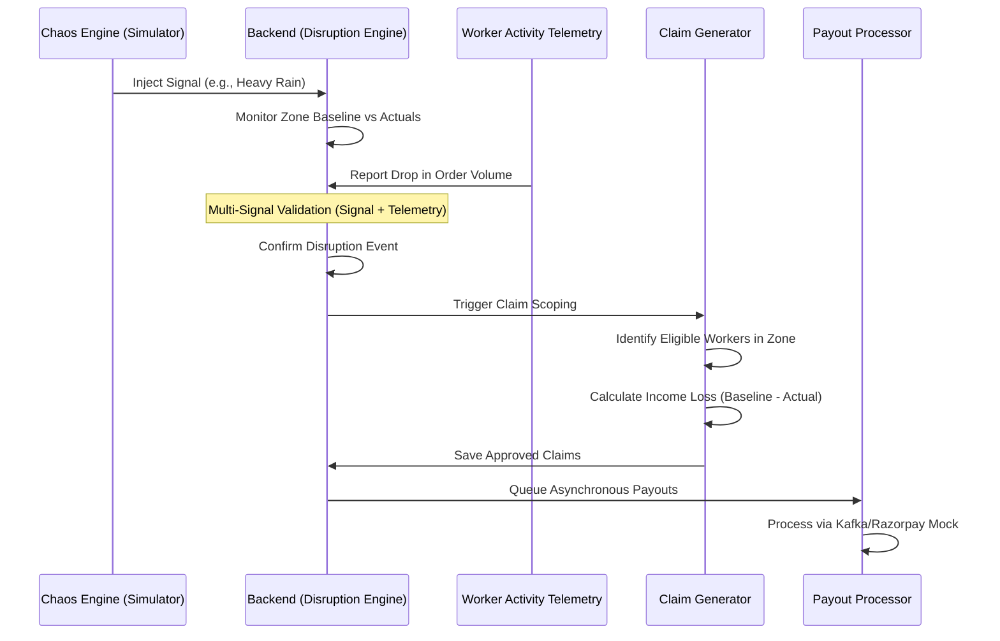

# InDel — Implementation Phase 2

This document provides a technical and execution-focused overview of the InDel platform as implemented in Phase 2.
> [!NOTE]
> Refer to the SETUP.md for instructions on how to run the project locally.
## Functional Architecture

InDel is an event-driven parametric insurance ecosystem designed to protect gig-worker income from regional disruptions. The architecture is composed of a high-performance Go backend, dual enterprise React dashboards, and a native mobile application.

### System Components

The following diagram illustrates the high-level relationship between the platform's core components:


###  Economic Impact Lifecycle

This sequence diagram traces the flow from a triggered disruption to an automated payout:



---

## Repository Structure

The repository is organized into distinct modules for backend logic, dashboard management, and mobile operations.

###  Repository Root
- `backend/`: Core Go API and business logic.
- `insurer-dashboard/`: React application for insurance providers.
- `platform-dashboard/`: React application for platform operators and simulator control.
- `worker-app/`: Native Kotlin implementation for worker-side tracking and notifications.
- `migrations/`: SQL schema definitions and baseline data seeds.
- `ml/`: Model training scripts and synthetic data generators.
- `PHASE_2.md`: This implementation-focused documentation.
- `README.md`: High-level project vision and theoretical background.

###  Backend Deep Dive (`/backend`)
- `cmd/api/`: Entry point for the Gin server.
- `internal/handlers/`: Domain-specific API endpoint logic.
    - `platform/`: Zone monitoring and Chaos Engine endpoints.
    - `insurer/`: Policy and risk analytics endpoints.
    - `worker/`: Identity and notification endpoints.
    - `demo/`: Specialized simulation and seeding handlers.
- `internal/services/`: The "Engine" layer containing core business logic.
    - `disruption_engine.go`: Logic for real-time baseline calculation and disruption confirmation.
    - `core_ops_service.go`: Batch processing for claim generation, eligibility checks, and payouts.
    - `premium_pricing.go`: Dynamic risk-based pricing logic.
- `internal/models/`: GORM-based entity definitions (Users, Zones, Policies, Claims).
- `internal/router/`: Centralized Gin route definitions.

###  Dashboard Deep Dive (`/platform-dashboard` & `/insurer-dashboard`)
- `src/api/`: Axios-based clients for backend communication.
- `src/components/`: Reusable UI components.
    - `layout/`: Shared Sidebar and Navbar with theme management.
    - `ui/`: Atomic components like panels, badges, and metrics.
- `src/pages/`: Feature-specific views.
    - `Overview.tsx`: Holistic system health telemetry.
    - `Disruptions.tsx`: The "Chaos Engine" simulation interface.
    - `Workers.tsx`: Native-style searchable node directory.
- `src/context/`: React Context for Theme (Light/Dark) and Global State.

---

##  Core Functional Components

### 1. Disruption Engine (The Brain)
The engine maintains a sliding 10-minute window of regional order volume. It calculates a **Dynamic Baseline** for each zone. A disruption is confirmed only through **Multi-Signal Validation**:
- **Environmental**: External signal (Weather, AQI, Curfew).
- **Economic**: Internal telemetry showing a >30% drop in order volume relative to the baseline.

### 2. Core Ops Service (The Scale)
This service handles high-volume batch operations. When a disruption is confirmed, it:
1. Scans the database for all workers with **Active Policies** in the affected zone.
2. Identifies workers who were **Logged In** during the disruption.
3. Computes **Income Loss** using the worker's historical 4-week average vs. actual earnings.
4. Generates a **Claim Record** with an automated fraud verdict based on the signal strength.

### 3. Chaos Engine (The Simulator)
Integrated directly into the Platform Dashboard, the Chaos Engine provides a practical way to test the entire parametric pipeline. It allows for:
- **Demand Collapse**: Artificially resetting the baseline to simulate a massive order drop.
- **Signal Injection**: Sending real-time weather or local restriction events to the backend.

### 4. Machine Learning & Risk Modeling
InDel uses a dual-layer approach for pricing and fraud detection, combining XGBoost regressors with deterministic fallback formulas for mission-critical reliability.

#### ML Architecture
- **Predictive Pricing (XGBoost)**: Analyzes 18 variables including zone risk, vehicle type, weather stats, and historical volatility to determine optimal worker premiums.
- **Anomaly Detection (Isolation Forest)**: Provides unsupervised fraud detection by identifying claims that deviate significantly from regional economic baselines.
- **State Clustering (DBSCAN)**: Identifies coordinated suspicious activity among worker cohorts to prevent multi-node spoofing.

#### 📊 Risk Assessment Formulas
To ensure transparency and operational robustness, InDel utilizes a tiered mathematical model for risk and pricing.

**1. Weighted Risk Score ($R$)**
The primary indicator for regional disruption probability, derived from live telemetry and historical volatility:

$$
R = (V_o \cdot 0.24) + (V_e \cdot 0.22) + (D_r \cdot 0.20) + (S_{weather} \cdot 0.34)
$$

| Variable | Definition | Impact Weight |
| :--- | :--- | :--- |
| $V_o$ | **Order Volatility** (Regional demand variance) | 24% |
| $V_e$ | **Earnings Volatility** (Worker-side income variance) | 22% |
| $D_r$ | **Disruption Rate** (Historical zone events) | 20% |
| $S_{weather}$ | **Aggregated Weather Signal** (Rain/AQI/Temp) | 34% |

**2. Dynamic Premium Calculation ($P$)**
Individual weekly premiums are calculated against the worker's average daily earnings ($E_{avg}$), weighted by their current Risk Score ($R$) and a Vehicle Factor ($VF$):

$$
P = (E_{avg} \cdot 0.0375) \times (0.72 + R) \times VF
$$

> [!TIP]
> The **Vehicle Factor ($VF$)** ranges from **1.04 to 1.08** based on the vehicle class (EVs vs Internal Combustion) to reward sustainable delivery methods.

---
## Platform Dashboard(Web App)


## Insurer Dashboard(Web App)


## Worker Dashboard(Mobile App)


---
## Technical Specifications

- **Backend**: Go (Gin), PostgreSQL (GORM), JWT.
- **Frontend**: React 18 (Vite), Tailwind CSS, Lucide Icons.
- **Theme**: Enterprise High-Precision (Slate/Orange).
- **Communication**: 2-second polling interval for real-time telemetry updates.

---
## Local Development Setup

This guide explains how to run the InDel platform locally, including backend services, web dashboards, and the mobile application.

---

### 1. Prerequisites

Ensure the following tools are installed:

- Docker and Docker Compose  
- Node.js (v18 or higher recommended)  
- npm or yarn  
- Android Studio (for mobile application)

---

### 2. Determine Local IP Address

You may need your local IP address when running the mobile app on a physical device.

**macOS**
```bash
ipconfig getifaddr en0
```

**Windows**
```bash
ipconfig
```

**Linux**
```bash
hostname -I
```

---

### 3. Environment Configuration

Create a `.env` file in the root directory.

You can copy from `.env.example`:

```bash
cp .env.example .env
```

---

### 4. Start Backend and ML Services

Run all backend services (PostgreSQL, Kafka, APIs, ML models) using Docker.

**Demo Environment (recommended)**
```bash
COMPOSE_PARALLEL_LIMIT=1 docker compose -f docker-compose.demo.yml up --build -d
```

**Production Environment**
```bash
COMPOSE_PARALLEL_LIMIT=1 docker compose up --build -d
```

---

### 5. Run Web Dashboards

Open two terminals:

**Platform Dashboard**
```bash
cd platform-dashboard
npm install
npm run dev
```

**Insurer Dashboard**
```bash
cd insurer-dashboard
npm install
npm run dev
```

---

### 6. Run Mobile Application

1. Open `worker-app` in Android Studio  
2. Wait for Gradle sync  
3. Select emulator or physical device  
4. Run the app  

**Important:**
- If using a physical device, replace `127.0.0.1` in `.env` with your local IP (e.g., `192.168.x.x`)  
- Ensure both laptop and mobile device are connected to the same network  

---

### 7. Verification

- Backend services running via Docker  
- Dashboards accessible in browser  
- Mobile app connected to backend  

---

### 8. Troubleshooting

- **Connection issues**: Check `.env` IP configuration  
- **Docker issues**: Use `COMPOSE_PARALLEL_LIMIT=1`  
- **Mobile not connecting**: Ensure same Wi-Fi network 

---

## Environment Variables Template

Create a `.env.example` file:

```env
# InDel — Master Environment File (Template)

# PostgreSQL
POSTGRES_USER=your_db_user
POSTGRES_PASSWORD=your_db_password
POSTGRES_DB=your_db_name
DB_USER=your_db_user
DB_PASSWORD=your_db_password
DB_NAME=your_db_name

# Network
HOST_IP=127.0.0.1
API_BASE_URL=http://127.0.0.1:8001/
API_BASE_URL1=http://127.0.0.1:8003/

# ML Services
PREMIUM_ML_URL=http://127.0.0.1:9001
FRAUD_ML_URL=http://127.0.0.1:9002
FORECAST_ML_URL=http://127.0.0.1:9003

# External APIs
OPENWEATHERMAP_API_KEY=your_openweathermap_api_key
OPENAQ_API_KEY=your_openaq_api_key

# Firebase
FIREBASE_API_KEY=your_firebase_api_key
FIREBASE_PROJECT_ID=your_project_id
FIREBASE_PROJECT_NUMBER=your_project_number
FIREBASE_STORAGE_BUCKET=your_storage_bucket
FIREBASE_APP_ID=your_app_id
FIREBASE_SERVER_KEY=your_server_key

# Kafka
KAFKA_BROKERS=kafka:9092

# Frontend APIs
VITE_INSURER_API_URL=http://127.0.0.1:8002
VITE_CORE_API_URL=http://127.0.0.1:8000
VITE_PLATFORM_API_URL=http://127.0.0.1:8003
```

---


> [!NOTE]
> All automated systems are idempotent, ensuring that mass disruption events do not cause duplicate claim generation or payout errors.
