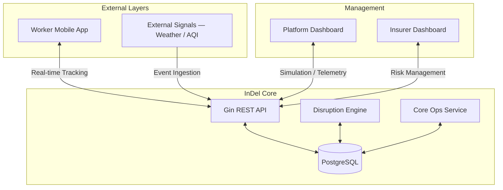
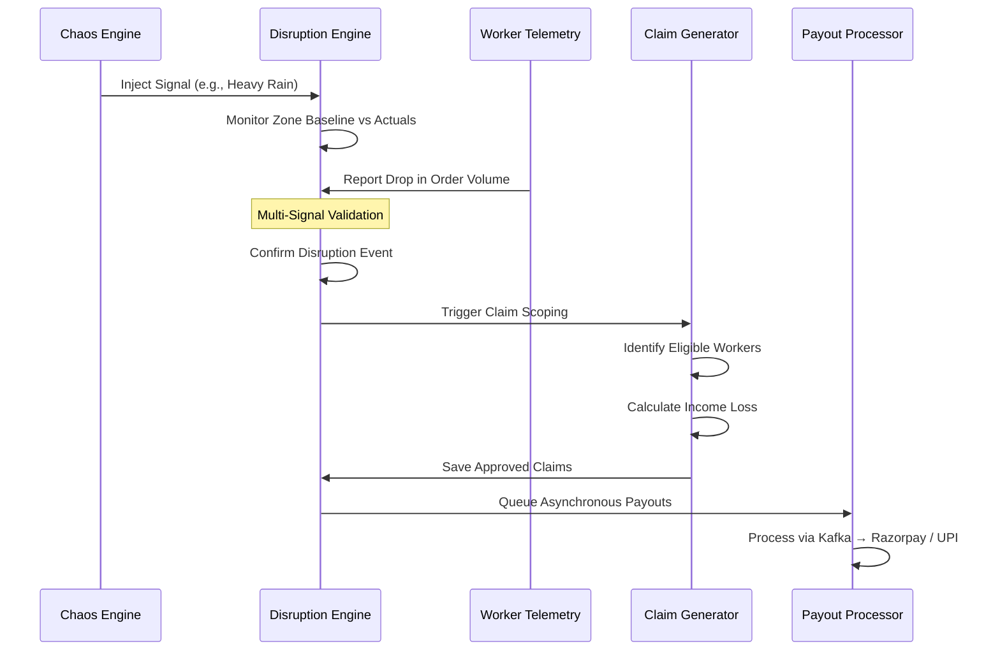

# InDel — Insure, Deliver

> **When the rain falls, the orders stop. Workers lose income. Nothing protects them.**
> InDel changes that — parametric income insurance, zero-touch and automated, built for India's gig economy.

<p align="center">
  
  
  
  
  
</p>

<p align="center">
  <a href="https://www.youtube.com/watch?v=R1_1X-f7-MM">
    
  </a>
  &nbsp;
  <a href="./SETUP.md">
    
  </a>
</p>

---

## The Problem

India has **15+ million gig delivery workers**. Their income is entirely contingent on completing orders. When a flood hits, when AQI crosses hazardous, when a curfew drops — deliveries stop. Income collapses. There is no fallback.

Workers lose **20–30% of monthly income** during disruption events. Not a single insurance product on the market covers this.

Traditional insurance covers accidents and vehicles. Existing parametric attempts need delivery platforms to share worker data — and those platforms have no incentive to. The result: unverifiable claims, weak fraud detection, no product that works at scale.

**InDel doesn't ask for that data. It owns it.**

---

## The InDel Approach

InDel is a **B2B parametric income insurance platform** — built for insurance providers who want to reach an underserved, high-volume worker segment without building the data infrastructure themselves.

```
❌ Old way:
Insurer → requests data from Amzon/Flipkart → access denied → weak verification → fraud

✅ InDel way:
Insurer deploys InDel → integrates with delivery platform via API
→ delivery + insurance share one first-party data layer
→ accurate verification → automated payouts → zero manual claims
```

The insurer gets a ready-to-deploy infrastructure. The worker gets protection that runs silently in the background. **They never file a claim. It just arrives.**

> Numbers that matter — 1,000 workers, Chennai, one month:
> **₹68,000** premiums collected · **₹44,000** payouts · **35% gross margin** · **~65% loss ratio** (industry benchmark: 70–85%)

---

## How the System Works



From signal to payout — entirely automated:



---

## Worker Onboarding & Policy Management

Workers register once. Coverage runs forever in the background — no renewals, no forms, no calls.

Onboarding captures name, home zone, preferred hours, vehicle type (EV or ICE — this affects pricing), UPI/bank details, and device ID for fraud prevention. Income protection is **opt-in**, surfaced as a clear separate choice. Once enrolled, everything is automatic.

**Policy states:**

| State | Trigger |
|---|---|
| **Active** | Premium paid, coverage running |
| **Paused** | 1 missed weekly payment |
| **Suspended** | 2+ consecutive missed weeks |
| **Rewarded** | Consistent payments + no claims → reduced premium or extended payout ceiling |

Cold-start workers (under 20 verified deliveries) use zone-average income baselines. Claims filed within the first 7 days of enrollment are auto-held for manual review — no gaming around known events.

---

## Dynamic Premium Calculation — The Intelligence Core

No flat rates. No city-wide averages. Every worker's premium is calculated fresh from their zone, their earnings history, and live environmental signals.

### The Risk Score

$$R = (V_o \times 0.24) + (V_e \times 0.22) + (D_r \times 0.20) + (S_{weather} \times 0.34)$$

| Variable | What it measures | Weight |
|---|---|---|
| $V_o$ | Order Volatility — how erratic zone demand is | 24% |
| $V_e$ | Earnings Volatility — how stable this worker's income is | 22% |
| $D_r$ | Disruption Rate — historical event frequency in this zone | 20% |
| $S_{weather}$ | Aggregated Weather Signal — live rain, AQI, temperature | **34%** |

Weather leads at 34% because it is the strongest predictor of delivery income loss across Indian urban zones. A waterlogged Tambaram in August is not the same risk as Koramangala in January — InDel prices accordingly.

### The Premium Formula

$$P = (E_{avg} \times 0.0375) \times (0.72 + R) \times VF$$

- **$E_{avg}$** — worker's average daily earnings over 4 weeks, from InDel's own first-party records
- **$R$** — the risk score above, recalculated monthly (continuous in production)
- **$VF$** — Vehicle Factor 1.04–1.08: EVs carry a lower multiplier, rewarding sustainable delivery

**Same worker, different zones, different premiums:**

| Zone | Risk Level | Weekly Premium | Max Weekly Payout |
|---|---|---|---|
| Tambaram, Chennai | High — monsoon + heat | ₹22 | ₹800 |
| Rohini, Delhi | Medium | ₹17 | ₹700 |
| Koramangala, Bengaluru | Low | ₹12 | ₹600 |

### SHAP Explainability — Every Premium is Auditable

The XGBoost model is trained on 18 features: zone disruption history, monsoon proximity, rolling AQI averages, earnings variance, and more. Behind it sits full SHAP explainability — every premium breaks down to its contributing factors, surfaced to the worker in plain language:

```
Your premium this week: ₹18
  Flood risk in your zone    +₹6
  Recent AQI pattern         +₹3
  Income instability score   +₹2
  Base rate                   ₹7
```

Available in all major Indian languages. This same breakdown powers the **Maintenance Check** — workers can see exactly why they pay what they pay and dispute it if something looks wrong.

---

## 5 Automated Disruption Triggers

InDel runs five signal types simultaneously via public and mock APIs. No polling — the system reacts to structured events as they arrive.

| Trigger | Source | Fires when |
|---|---|---|
| `WEATHER_ALERT` | OpenWeatherMap | Rainfall, flood, or extreme heat threshold crossed |
| `AQI_ALERT` | OpenAQ / WAQI | Pollution exceeds hazardous levels |
| `ORDER_DROP_DETECTED` | InDel internal telemetry | Zone order volume drops >30% vs sliding baseline |
| `ZONE_CLOSURE_ALERT` | Traffic API / Govt alerts | Curfew, strike, or zone restriction detected |
| `WORKER_ACTIVITY_UPDATE` | InDel platform | Login, acceptance, and completion pattern anomaly |

**One signal is never enough.** A disruption is confirmed only when an external environmental signal and an internal order volume drop align simultaneously — within a time-lag window that accounts for the delay between, say, rainfall starting and orders actually collapsing.

A heat wave with no delivery impact triggers nothing. An order slump under clear weather triggers nothing. InDel verifies **economic reality**, not atmospheric conditions.

---

## Zero-Touch Claim Process — Workers Do Nothing

The single most important UX decision in InDel: **workers never file a claim.**

```
Disruption confirmed by multi-signal validation
        ↓
Zone scan — active policy + logged in during event + acceptance rate above threshold?
        ↓
Income loss computed automatically
  Baseline = 4-week average hourly earnings (InDel first-party)
  Loss     = Expected − Actual earnings during disruption window
  Payout   = Loss × coverage ratio (80–90%), capped at weekly max
        ↓
Three-layer fraud check runs independently
  Layer 1 — Isolation Forest: anomaly detection on claim profile
  Layer 2 — DBSCAN: does this worker's behaviour match their zone cluster?
  Layer 3 — Hard rules: GPS in zone? No deliveries completed during the window?
        ↓
  Low-risk  → auto-approved instantly
  Medium    → delayed for additional validation
  High-risk → manual review queue
        ↓
Worker notified with full breakdown
Payout queued → Kafka → Razorpay / UPI / wallet
```

**A real example:**

> Worker in Tambaram, ₹120/hour average earnings. Flood logged 11:40 AM → 5:30 PM.

```
Expected:   ₹120 × 5.83 hrs = ₹700
Actual:     2 partial orders = ₹80
Loss:                          ₹620
Payout:            85% of ₹620 = ₹527  →  UPI, same day
```

The worker received a notification. They never opened a form.

---

## Infrastructure — Kafka, Zookeeper & Docker

This is what makes zero-touch at scale actually work.

### Apache Kafka — Payout Durability Under Pressure

Every approved claim enters a Kafka topic as an event. During a mass disruption — a citywide flood, five zones hit simultaneously — thousands of payout events fire in minutes. Kafka handles this without touching the claim pipeline.

**Why Kafka and not a simpler queue?**

- **Replayable offsets:** If the payment gateway fails mid-batch, Kafka replays from the last committed offset — no duplicates, no dropped payouts.
- **Consumer group isolation:** The payout processor and audit logger are separate consumer groups on the same topic. Audit capture never blocks payment throughput.
- **Horizontal scaling:** Additional processor instances spin up during surges and pick up unconsumed partitions automatically.
- **Persistent audit log:** Every payout attempt — sent, succeeded, retried, failed — is retained. This is a regulatory expectation for insurance products. Message queues that delete on consumption cannot guarantee the same.

### Apache Zookeeper — Kafka's Coordination Backbone

Zookeeper manages broker registration, partition leader election, and consumer group offset tracking. In InDel's deployment, Zookeeper runs as a dedicated container alongside Kafka. If a broker container restarts, Zookeeper elects a new partition leader automatically — no manual intervention, no lost messages. Failover is transparent to the payout processor, which reconnects and resumes from its last committed offset.

The demo environment runs one Zookeeper instance and one Kafka broker. Production would use a 3-node Zookeeper ensemble for full fault tolerance. This pairing — Kafka for durability, Zookeeper for coordination — is what guarantees a mass disruption event never pays a worker twice or misses them entirely.

### Docker — The Entire Stack in One Command

Every InDel service runs as a container. The full backend — API, database, message broker, coordination service, and three ML model servers — starts with:

```bash
COMPOSE_PARALLEL_LIMIT=1 docker compose -f docker-compose.demo.yml up --build -d
```

| Container | Role |
|---|---|
| `indel-api` | Go/Gin REST API |
| `postgres` | PostgreSQL, migrations pre-applied |
| `zookeeper` | Kafka coordination |
| `kafka` | Async payout broker |
| `ml-premium` | XGBoost pricing server (port 9001) |
| `ml-fraud` | Isolation Forest + DBSCAN (port 9002) |
| `ml-forecast` | Prophet forecasting (port 9003) |

`COMPOSE_PARALLEL_LIMIT=1` enforces startup order — Zookeeper before Kafka, Kafka before the API — preventing cold-start connection failures. The demo compose uses pre-seeded snapshots: the platform launches already populated with workers, zones, and disruption history. No manual setup. One command.

---

## Claims Management & Fraud Defense

A claim lifecycle runs entirely within InDel — auto-generated, fraud-scored, routed, paid, and logged without external tools or manual data entry.

**Fraud defense is economic, not geographic.** GPS is spoofable. InDel doesn't ask "Was the worker in the zone?" — it asks "Did this worker experience a loss consistent with every other worker in this zone during this event?" That question is much harder to fake.

| A genuine worker shows... | A fraudulent claim shows... |
|---|---|
| Earnings drop matching zone peer cluster | Activity pattern unchanged through the event |
| Increased idle time as order volume collapses | Claim loss diverging from zone-wide trend |
| Failed or reduced delivery attempts during window | GPS outside the affected zone at trigger time |

Completed deliveries logged during a claimed window → auto-rejected. DBSCAN outliers whose behaviour diverges from the entire zone cluster → manual review.

### Maintenance Check — Self-Service Claim Audit

Workers can trigger a self-service audit (max 3/day) if they believe they missed a valid claim. The system calls the AI API with the worker's full activity record, zone signals, and SHAP breakdown — returning a plain-language explanation in the worker's preferred language. Simultaneously logged in the insurer's review queue for human follow-up. Supported across all major Indian languages, with icon-based visual cues for low-literacy users.

---

## The Dashboards

### Platform Dashboard — for Operators

Real-time zone telemetry, live order flow, worker GPS distribution — and the **Chaos Engine**: simulate demand collapse or inject weather/AQI signals to test the full claim pipeline without waiting for a real flood.


### Insurer Dashboard — for Providers

Premium pool health, loss ratio by zone and city, fraud-flagged claims queue, 7-day Prophet disruption forecast for reserve planning. Every number an actuary needs, live.


### Worker App — for Delivery Partners

Coverage status, this week's premium, earnings vs protected income, active disruption alerts, claim history, continuity reward progress, and Maintenance Check — one screen. Payment via Razorpay UPI.


---

## ML Under the Hood

| Model | Algorithm | Job | Retraining |
|---|---|---|---|
| Premium Calculator | XGBoost + SHAP | Predicts income loss probability → weekly premium per worker | Monthly / continuous |
| Fraud Detector | Isolation Forest + DBSCAN + Rules | Anomaly score + cluster fit + hard disqualifiers | Weekly |
| Disruption Forecaster | Facebook Prophet | 7-day zone claim probability — insurer reserve planning only | Weekly |

---

## Tech Stack

| Layer | Technology |
|---|---|
| Backend | Go (Gin), PostgreSQL (GORM), JWT |
| Frontend | React 18 (Vite), Tailwind CSS, Lucide Icons |
| Mobile | Kotlin (Android) |
| Async Messaging | Apache Kafka + Apache Zookeeper |
| Containerisation | Docker, Docker Compose |
| ML | XGBoost, SHAP, Isolation Forest, DBSCAN, Prophet (scikit-learn) |
| Weather | OpenWeatherMap |
| AQI | OpenAQ / WAQI |
| Payments | Razorpay test mode / UPI simulator |
| Notifications | Firebase Cloud Messaging |

---

## Team ImaginAI

Five people. One conviction: gig workers deserve financial protection that works as hard as they do.

| | Name | Built |
|---|---|---|
| 🧮 | Shravanthi S | Core Policy, Premium Cycle, Payout & Data Operations |
| 🚚 | Gayathri U | Delivery Management & DevOps |
| 🤖 | Rithanya K A | ML Services — Training & Serving |
| ⚡ | Saravana Priyaa C R | Platform Integration, Disruption Engine |
| 🛡️ | Subikha MV | Insurer System, Claims Intelligence & System Design |

---

<p align="center">
  <i>Submitted for Guidewire DEVTrails 2026 — University Hackathon</i><br><br>
  <i>Figures are illustrative estimates for design and modelling purposes. Production deployment requires IRDAI registration and KYC/AML compliance by the deploying insurer. All systems are idempotent — mass disruption events cannot produce duplicate claims or double payouts.</i>
</p>
