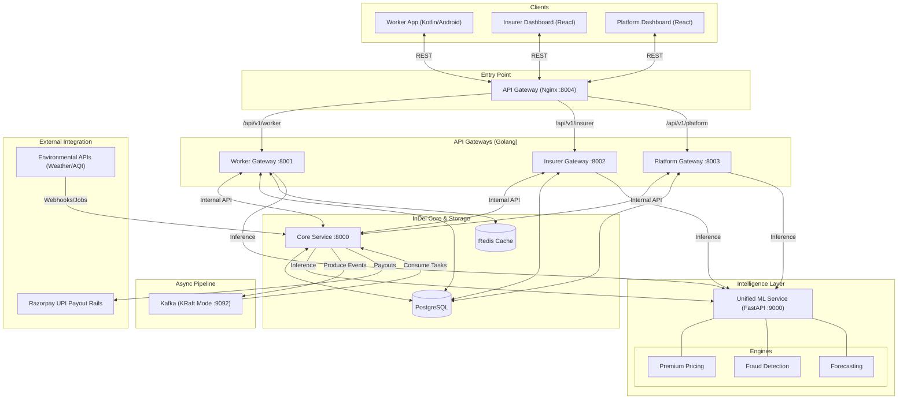

# InDel — Insure, Deliver

> **The rain starts at 11:40 AM. Orders stop. Income collapses. The worker does nothing.**
> **At 5:30 PM, ₹527 hits their UPI. No form. No call. No claim. Just money.**

<p align="center">
  
  
  
  
  
</p>

<p align="center">
  <a href="https://www.youtube.com/watch?v=R1_1X-f7-MM">
    
  </a>
  &nbsp;&nbsp;
  <a href="./SETUP.md">
    
  </a>
</p>

---

## Pitch Deck

You can view our complete project pitch deck here:

[View Pitch Deck](https://drive.google.com/file/d/1xtUFPMNEktznhHQtsVwRI5vB8clwfVZw/view?usp=sharing)

---
## The Problem Nobody Has Solved

India has **15+ million gig delivery workers**. Every rupee they earn depends on one thing: completing orders.

Floods. Hazardous AQI. Curfews. Zone closures. When any of these hit — deliveries stop, income collapses, and there is **zero fallback**. Workers lose **20–30% of monthly income** during disruption events.

Traditional insurance covers accidents and vehicles. Existing parametric attempts require delivery platforms to share worker data — platforms that have zero incentive to cooperate. The result is unverifiable claims, rampant fraud, and no product that works at scale.

**The market gap is real. The workers are real. InDel is the answer.**

---

## What Makes InDel Different

Every other parametric system asks: *"Was the worker inside the disrupted zone?"*
GPS is trivially spoofed. That question is the wrong one.

**InDel asks: did this worker's economic reality collapse?**

```
❌ Old way:
Insurer → requests data from Amazon / Flipkart
→ access denied → weak verification → fraud → no product

✅ InDel way:
Insurer deploys InDel → integrates with delivery platform via API
→ first-party data layer owned by InDel
→ verified disruption → automated payout → zero manual claims
```

The insurer gets ready-to-deploy infrastructure. The worker gets protection that runs silently in the background. **They never file a claim. It just arrives.**

---

## Numbers That Matter

> **Pilot simulation — 1,000 workers, Chennai, one month**

| Metric | Value |
|---|---|
| Premiums collected | ₹68,000 |
| Payouts disbursed | ₹44,000 |
| Gross margin | **35%** |
| Loss ratio | **~65%** *(industry benchmark: 70–85%)* |

We are already inside the profitable band — before scale.

---

## Phase 3 Deliverables — Every Box Checked

| Requirement | InDel Implementation | Status |
|---|---|---|
| **Advanced Fraud Detection** | 3-Layer Stacked Threat Engine — IsolationForest + DBSCAN + Postgres Hard Rules across 6 behavioral dimensions | ✅ Fully Implemented |
| **Instant Payout System** | Native KRaft-mode Kafka async pipeline → Razorpay UPI, idempotent offsets, 5× exponential retry | ✅ Fully Implemented |
| **Intelligent Dashboards** | Worker: multilingual SHAP audit + earnings protection · Insurer: Prophet 7-day reserve analytics + live fraud queue | ✅ Fully Implemented |
| **Edge-Resilient Mobile App** | Offline-first Android architecture powered by Room databases dynamically synced with secure auth boundaries preventing cross-worker state bleed. | ✅ Fully Implemented |

---

## Increasing Efficiency of Resource Utilization

To evolve from a functional hackathon submission to a heavily resilient, production-ready architecture, we significantly restructured the system footprint based on edge-performance and resource consumption.

### 1. Unified Machine Learning Container (FastAPI / XGBoost / Prophet)
Instead of deploying three highly disjointed Python microservices (Premium Pricing, Fraud Detection, Forecaster) that natively inflated the infrastructure by artificially multiplying Python interpreter memory overhead—we entirely refactored the ML environment. All inference tools now share a single dense **FastAPI** container (`ml-service`), dropping computational footprint by two-thirds without compromising parallel throughput.

### 2. High-Performance Messaging Protocol (Kafka KRaft Mode)
Zookeeper acts as a significant memory burden. We've stripped out external Kafka coordination services and fully migrated to **Zookeeper-less KRaft Mode**. Kafka now natively manages partition leadership via quorum, shedding immense JVM latency and permitting the entire orchestration suite to run cleanly on bounded compute.

### 3. Defensive Actuarial Boundaries
Dynamic Machine Learning struggles intrinsically with "Cold Start" user distributions. Recognizing that new workers generated wild extrapolations from our XGBoost regressor, we introduced a mathematical bounding wrapper layer directly to the inference API. Out-of-bounds calculations instantly clamp to stable base premiums (e.g. ₹49), guaranteeing logical actuarial safety against systemic risks.

### 4. Zero-Contamination Offline-First Sync (Android Room DB)
Gig delivery platforms share a notorious edge-case: multi-account logins on identical hardware. We hardened the existing offline-first Android interface by systematically purging the underlying encrypted **Room Databases** dynamically on token generation/revocation. Dashboard rendering states are mathematically isolated per-user natively, fully eliminating cross-state ghost profiles.

---

## The Core Insight: Verify Economic Reality, Not GPS

Five signals run simultaneously. **One signal is never enough.**

| Trigger | Source | Fires When |
|---|---|---|
| `WEATHER_ALERT` | OpenWeatherMap | Rainfall / flood / extreme heat threshold crossed |
| `AQI_ALERT` | OpenAQ / WAQI | Pollution exceeds hazardous levels |
| `ORDER_DROP_DETECTED` | InDel internal telemetry | Zone order volume drops >30% vs sliding baseline |
| `ZONE_CLOSURE_ALERT` | Traffic API / Govt alerts | Curfew, strike, or zone restriction detected |
| `WORKER_ACTIVITY_UPDATE` | InDel platform | Login, acceptance, and completion pattern anomaly |

A disruption is confirmed **only** when an external environmental signal and an internal order volume collapse align simultaneously — with a time-lag window that accounts for the real-world delay between rainfall starting and orders actually stopping.

A heatwave with no delivery impact? Triggers nothing. An order slump under clear skies? Triggers nothing. InDel verifies **economic reality** — not atmospheric conditions.

---

## System Architecture



---

## Zero-Touch Claim Flow — Workers Do Nothing

```
Environmental signal received — weather / AQI / curfew
        ↓
Order velocity collapse confirmed — >30% drop vs 4-week baseline
        ↓
Multi-signal lock engaged — both must align within time-lag window
        ↓
Zone scan — active policy + TTL heartbeat check + acceptance rate threshold
        ↓
Income loss computed automatically
  Baseline  =  4-week average hourly earnings (InDel first-party data)
  Loss      =  Expected earnings − Actual earnings during disruption window
  Payout    =  Loss × coverage ratio (80–90%), capped at weekly maximum
        ↓
3-Layer fraud check runs independently
  Layer 1 — Isolation Forest: anomaly score on 6-dimension claim vector
  Layer 2 — DBSCAN: does this worker's behavior match their zone cluster?
  Layer 3 — Hard rules: GPS in zone? Zero deliveries during the window?
        ↓
  Low-risk   →  auto-approved instantly
  Medium     →  held for secondary validation
  High-risk  →  manual review queue with full violations JSON
        ↓
Worker notified with SHAP breakdown in their language
Payout: Kafka → Razorpay → UPI → worker's account
```

**A confirmed disruption event — Tambaram Flood, 11:40 AM to 5:30 PM:**

```
Worker baseline earnings:     ₹120 / hour
Expected over 5.83 hours:     ₹700
Actual (2 partial orders):     ₹80
Loss:                          ₹620
Payout at 85% coverage:        ₹527  →  UPI, same day
```

The worker received a notification. They never opened a form.

---

## Fraud Defense: 3-Layer Stacked Threat Engine

InDel intercepts claim vectors across **6 behavioral dimensions:**

```
[earnings_drop_ratio, avg_orders_per_hour, distance_routed,
 claim_frequency, approval_ratio, zone_risk]
```

### Layer 1 — Isolation Forest Anomaly Filter
Fraud syndicates push identical income loss claims across hundreds of accounts simultaneously. `IsolationForest(contamination='auto')` detects these — identical 6-dimension vectors generate anomalously short tree path-lengths. Score above `0.55` → structural claim delay. Genuine disruption creates uniquely staggered drops. Coordinated fraud creates near-identical vectors that the forest isolates immediately.

### Layer 2 — DBSCAN Spatial Clustering
During a verified flood, legitimate workers in a zone behave similarly — speeds drop, idle time rises, routing follows impaired road networks. DBSCAN clusters this behavior. Any worker whose telemetry diverges dramatically from the zone cluster is flagged as a noise point — catching sophisticated actors whose history looks clean but whose event-specific behavior is inexplicably wrong.

### Layer 3 — Postgres Hard Rules
No AI needed. Completed deliveries logged during the claimed disruption window → **auto-rejected.** Worker GPS outside zone boundaries before the event → **auto-rejected.**

Flagged claims are not dropped. They route to `manual_review` with a structured violations JSON:

```json
{
  "violations": [
    "AI Anomaly Threshold breached — Isolation Forest score: 0.87",
    "GPS Trace divergent from zone cluster (DBSCAN noise point)",
    "2 deliveries completed during claimed disruption window"
  ]
}
```

Human underwriters see the exact algorithmic reasoning. No database querying. No guesswork.

---

## Dynamic Pricing: Every Worker, Every Zone, Every Week

No flat rates. No city-wide averages. Each premium is computed fresh.

**Risk Score:**

```
R = (Order Volatility × 0.24) + (Earnings Volatility × 0.22)
  + (Disruption Rate × 0.20) + (Weather Signal × 0.34)
```

Weather leads at **34%** — the strongest predictor of delivery income loss across Indian urban zones.

**Premium Formula:**

```
P = (4-week avg daily earnings × 0.0375) × (0.72 + R) × Vehicle Factor
```

Vehicle Factor: **1.04 for EVs, 1.08 for ICE** — rewarding sustainable delivery.

| Zone | Risk Level | Weekly Premium | Max Weekly Payout |
|---|---|---|---|
| Tambaram, Chennai | High — monsoon + heat | ₹22 | ₹800 |
| Rohini, Delhi | Medium | ₹17 | ₹700 |
| Koramangala, Bengaluru | Low | ₹12 | ₹600 |

The XGBoost model trains on **18 features** — zone disruption history, monsoon proximity, rolling AQI averages, earnings variance, and more. Every premium is fully auditable via SHAP:

```
Your premium this week: ₹18
  Flood risk in your zone    +₹6
  Recent AQI pattern         +₹3
  Income instability score   +₹2
  Base rate                   ₹7
```

Available in **English, Tamil, and Hindi** — with icon-based visual cues for low-literacy users.

---

## TTL Gate: The Anti-Ghost-Login Defense

When disruption is confirmed, the system checks every worker's `lastActiveAt` telemetry timestamp against a **hardcoded 15-minute backward-looking window**, locked to the millisecond of disruption confirmation.

Dormant accounts that log in after seeing the rain? Stripped from eligibility arrays automatically. Payouts reach only workers who were genuinely on the ground when the disruption commenced.

---

## Kafka Payout Pipeline: Built for Mass Events

Synchronous API transfers during mass disruption = thread locking, gateway timeouts, duplicate calls, crashed backends.

InDel decouples claim approval from financial execution entirely via **Apache Kafka.**

| Kafka Property | Why It Matters |
|---|---|
| Replayable offsets | Razorpay `503`? Kafka replays from last committed offset — no duplicates, no lost payouts |
| Consumer group isolation | Payout processor and audit logger run as separate groups — audit never blocks payment |
| Horizontal scaling | Additional consumer instances spin up during surges, pick up unconsumed partitions automatically |
| Persistent audit log | Every payout attempt retained — sent, succeeded, retried, failed. Regulatory-grade trail. |

**KRaft Mode (Zookeeper-less Integration):** InDel utilizes Kafka's modern KRaft protocol to manage broker registration and partition leader election natively inside Kafka itself. This eradicates the massive JVM overhead previously associated with external coordination services. Broker restarts? The native KRaft controller enforces new leader election automatically via quorum. No manual intervention. No lost messages.

Five thousand workers claiming simultaneously during a citywide curfew: **handled.**

---

## Multilingual SHAP Explainability — 3-Step Architecture

Raw SHAP JSON passed to a translation engine breaks syntax entirely. InDel solves this with a purpose-built pipeline:

1. **JSON Templating** — Go backend maps raw SHAP numerics into predefined English structural templates
2. **Pre-verified Translation** — Tamil and Hindi structural templates stored statically, grammatically validated
3. **Dynamic Value Injection** — numeric values injected into the correct-language template at runtime

Technical precision preserved. Native grammar maintained. No translation artifacts.

**Supported:** English · Tamil · Hindi + icon-based visual cues for low-literacy users.

---

## Razorpay Integration — Money Moves Both Ways

**Premium collection:** Workers pay weekly AI-computed premiums via Razorpay Android Checkout SDK directly in-app. Nothing silently drops.

**Disruption payouts:**

| Step | Action |
|---|---|
| 1 | Claim approved — income loss calculated |
| 2 | Payout queued in Postgres with status `queued` |
| 3 | Backend calls Razorpay `POST /v1/payouts` with worker UPI + amount |
| 4 | Transient failures retried up to 5× with exponential backoff |
| 5 | Idempotency key `pay_clm_<claim_id>` — zero duplicate payouts |
| 6 | Status sync — `processed` on success, `failed` routes to human review |

A **10-second heartbeat goroutine** continuously drains the payout queue. Workers receive money within seconds — not hours, not the next business day.

---

## Infrastructure — One Command, Fully Running

```bash
COMPOSE_PARALLEL_LIMIT=1 docker compose -f docker-compose.demo.yml up --build -d
```

| Container | Role | Port |
|---|---|---|
| `indel-api` | Go / Gin REST API (Worker, Insurer, Platform gateways) | — |
| `postgres` | PostgreSQL, strict 1.0 CPU/ 1GB limits, migrations pre-applied | :5432 |
| `kafka` | Native KRaft async payout broker, stripped memory footprint | :9092 |
| `ml-service` | Unified Python FastAPI (XGBoost Pricing, Fraud, Forecast) | :9000 |

`COMPOSE_PARALLEL_LIMIT=1` enforces startup order logically. The entire environment forces aggressive container limit clamping (`deploy.resources.limits`) meaning massive scalability fits comfortably onto constrained single-server footprints. The demo compose launches **pre-seeded** with workers, zones, and disruption history. No manual setup. No configuration. One command.

---

## The Dashboards


### Platform Dashboard — for Operators
The primary administrative command center governing all continuous telemetry natively.
- **Platform Command & Worker Directory:** Monitor live order queues, geographic zone assignments, and track strict policy statuses (`Live | On Shift` vs `Offline`).
- **Analytics & Disruption Intelligence:** Visualize 7-day multi-city forecast metadata and monitor global claim-generation vs. manual-review queues in real-time.
- **The Chaos Engine:** A dedicated systems-testing panel. Select any tracked zone (e.g., Bhopal) and instantly trigger a `COLLAPSE DEMAND` event, or inject mock `Rain` and `Curfew` signals to validate the end-to-end Kafka payout pipeline safely without waiting for a real-world disaster.


### Insurer Dashboard — for Providers
The financial control center built specifically for actuaries and risk-management operators.
- **Pool Posture & Overview:** Monitor live capital liquidity, total premium accumulation versus payout liabilities, and track geographic 'Zone Net Flow' curves natively.
- **Global Claims Stream:** A real-time ledger of every automated disruption payout across the entire ecosystem, instantly classifying transactional states natively (e.g. `APPROVED`, `PAID`, or `MANUAL_REVIEW`).
- **Fraud Analysis Queue:** The human-in-the-loop audit portal. Underwriters review high-risk claims directly seeing the exact ML-identified signal (e.g., `NO_LIVE_WINDOW_ACTIVITY`) alongside the specific anomaly score, empowering them to quickly `Approve` or `Reject` flagged events.
- **Plan Status Management:** A visualization mapping active subscriber distribution across multiple zones, coupled with manual administrative controls to start or terminate individual coverage plans natively. 


### Worker App — for Delivery Partners
Coverage status, this week's AI-computed premium, earnings vs protected baseline, active disruption alerts, claim history, continuity reward progress, and the **Maintenance Check** self-service SHAP audit — all on one screen. Payment via Razorpay UPI.<br>
 <br>  <br>  <br> 

---

## ML Under the Hood

| Model | Algorithm | Job | Retraining |
|---|---|---|---|
| Premium Calculator | XGBoost + SHAP (18 features) | Income loss probability → weekly premium per worker | Monthly / continuous |
| Fraud Detector | IsolationForest + DBSCAN + Hard Rules | Anomaly score + cluster fit + hard disqualifiers | Weekly |
| Disruption Forecaster | Facebook Prophet | 7-day zone claim probability for insurer reserve planning | Weekly |

---

## Full Tech Stack

| Layer | Technology |
|---|---|
| Backend | Go (`net/http`, Gin), PostgreSQL (GORM), JWT |
| Frontend | React 18 (Vite + TypeScript), Tailwind CSS, Lucide Icons |
| Mobile | Kotlin (Android), Razorpay Android SDK |
| Async Messaging | Apache Kafka + Apache Zookeeper |
| Containerisation | Docker, Docker Compose |
| ML Serving | Python, FastAPI, `joblib` dynamic model state |
| AI Algorithms | XGBoost, SHAP, IsolationForest, DBSCAN, Prophet |
| Environmental APIs | OpenWeatherMap, OpenAQ / WAQI |
| Payments | Razorpay Payouts SDK / UPI simulator |
| Notifications | Firebase Cloud Messaging |
| Explainability | SHAP TreeExplainer + Google Cloud Translation / IndicTrans2 |

---

## Policy Lifecycle — No Renewals, No Calls, No Forms

Workers register once. Coverage runs forever in the background.

| State | Trigger |
|---|---|
| **Active** | Premium paid, coverage running |
| **Paused** | 1 missed weekly payment |
| **Suspended** | 2+ consecutive missed payments |
| **Rewarded** | Consistent payments + zero claims → reduced premium or extended payout ceiling |

Cold-start workers (under 20 verified deliveries) use zone-average income baselines. Claims filed within the first 7 days of enrollment are auto-held for manual review — no gaming around known events.

---

## Team ImaginAI

Five people. One conviction: gig workers deserve financial protection that works as hard as they do.

| Name | Built |
|---|---|
| Shravanthi S | Core Policy Logic, Disruption Sync Cycle, Payout & Data Operations |
| Gayathri U | Delivery Management, Postgres Schema, DevOps & Docker Compositions |
| Rithanya K A | Python FastAPI ML Services — XGBoost Training & Inference |
| Saravana Priyaa C R | Platform Integration, Chaos Engine, Disruption Engine |
| Subikha MV | Insurer System, Claims Intelligence & Overall System Design |

---

<p align="center"><b>Guidewire DEVTrails 2026 — E-Commerce Delivery Persona — Phase 3: Scale & Optimize</b></p>

<p align="center"><i>Figures are illustrative estimates for design and modelling purposes. Production deployment requires IRDAI registration and KYC/AML compliance by the deploying insurer. All systems are strictly idempotent — mass disruption events cannot produce duplicate claims or double payouts.</i></p>
